# Skill-Up 3 Contributing on GitHub

## Is this Skill Up for you?

### Yes

- Learn how to contribute for the first time
- Didn't contribute for a while
- Not familiar with Git command line

### No

- Sent a pull request last month
- Familiar with Git command line
- Want to port your material to the Carpentry style

  Please attend the Workshop 1 Bring and Build Your Own Lesson 'Carpentries-style' on Friday, 1 June from 9:00am until 12:30pm.
- Maintain one of the lessons

## Version of Lesson Style

This session uses [v9.5.0](https://github.com/swcarpentry/styles/releases/tag/v9.5.0).
Please be aware that some things can be different in previous or future versions.

## GitHub Account

Access [https://github.com](https://github.com) with your web browser.

On the top right corner, you can "Sign in" or "Sign up".

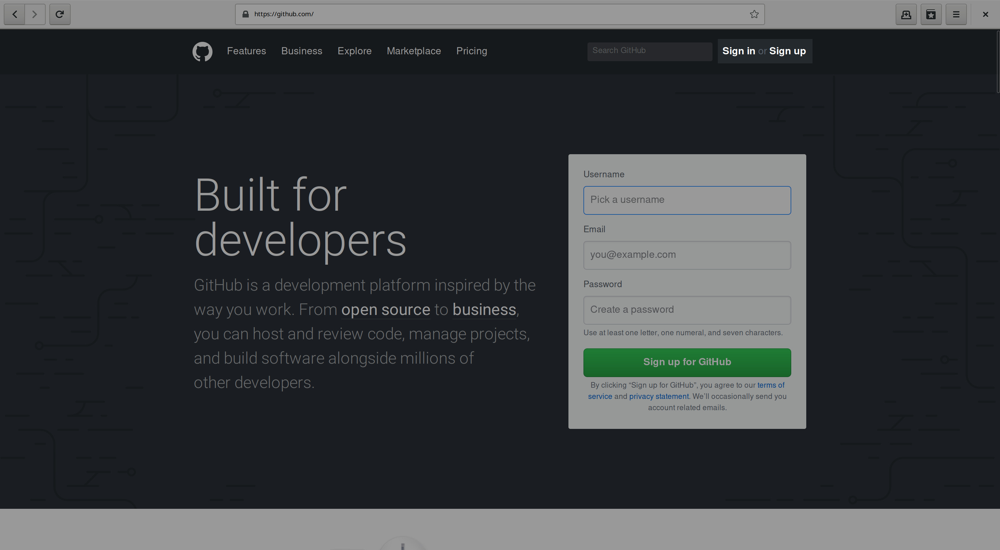

### Sign in

If you already have an account, you can "Sign in".

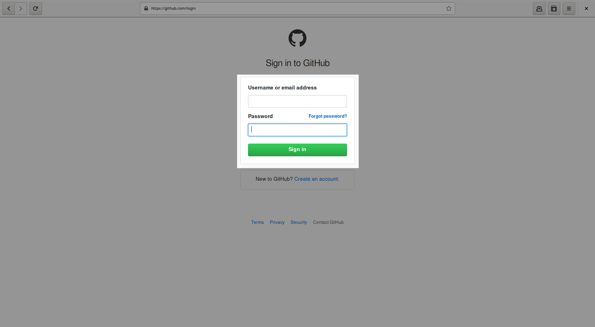

### Sign up

If you don't have an account, you can "Sign up" for one.

## File system

[https://github.com/rgaiacs/carpentrycon-skill-up-3-lesson-example](https://github.com/rgaiacs/carpentrycon-skill-up-3-lesson-example)
has a sample of the file system that you would find in any lesson.

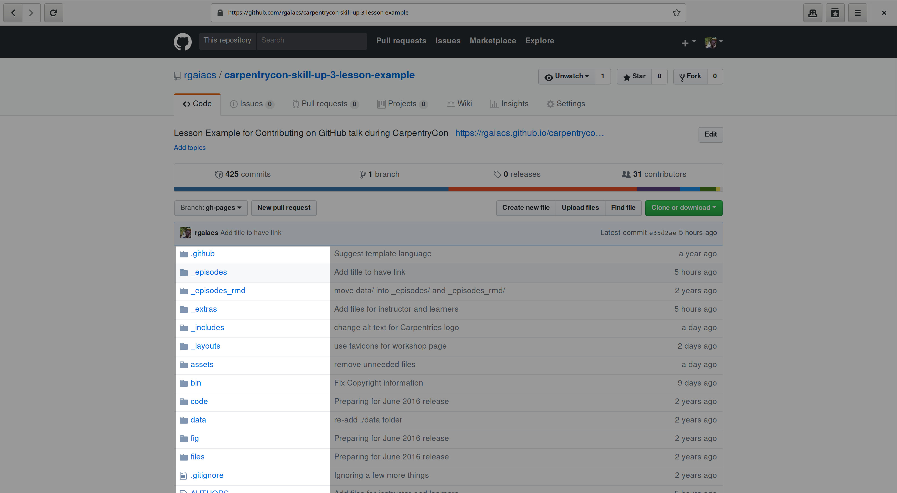

Most of the content of the lesson is under `_episodes`,
or in the case of an R lesson it is under `_episodes_rmd`.

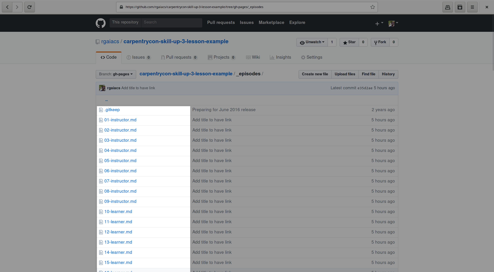

## Fork this project

To edit any file,
you will be required to have a fork,
i.e. your own copy of the project.

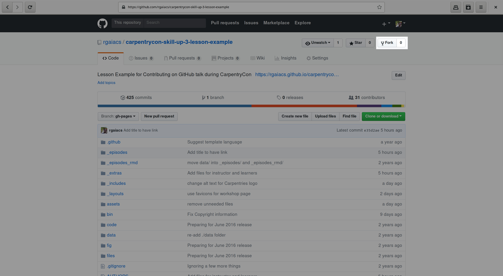

If you don't have a fork,
GitHub will create one for you at some point.

## Edit file

If you inspect any file,
you will find the option to edit it
at the top right corner of the file content.

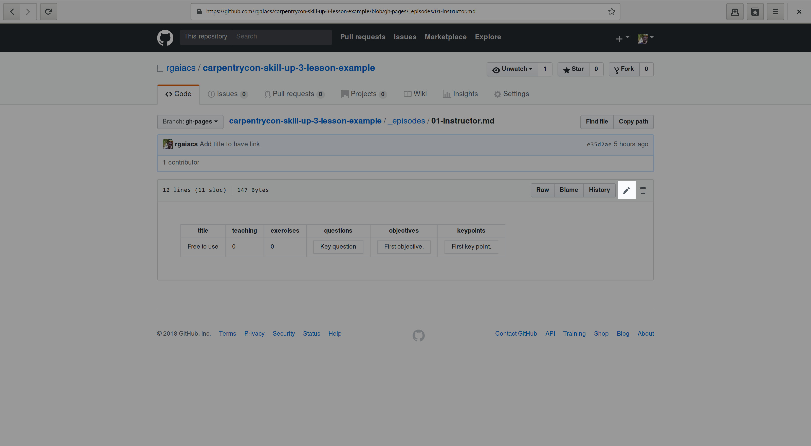

Links to edit the file are also available on the HTML version of the lesson.

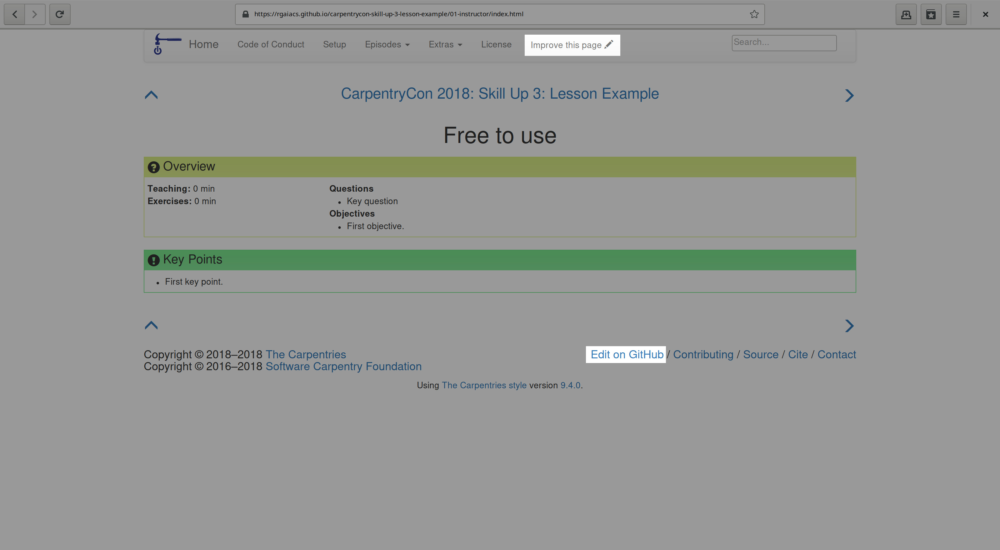

GitHub has a basic text editor.

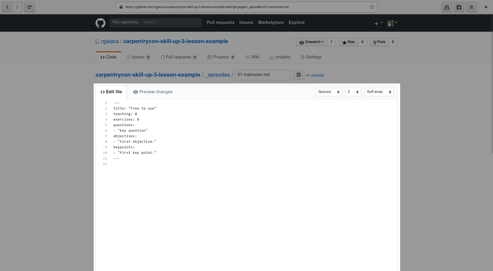

It is suitable for small editions.

After you change the file,
you **must** go to the end of the page
to propose the changes.

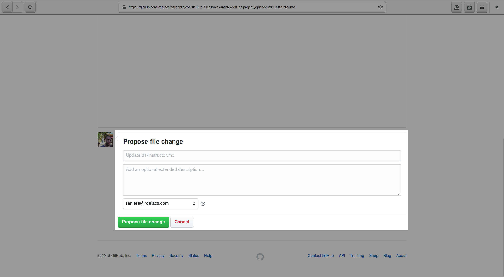

## Open a pull request

After save the changes,
you will be redirect to open a pull request.

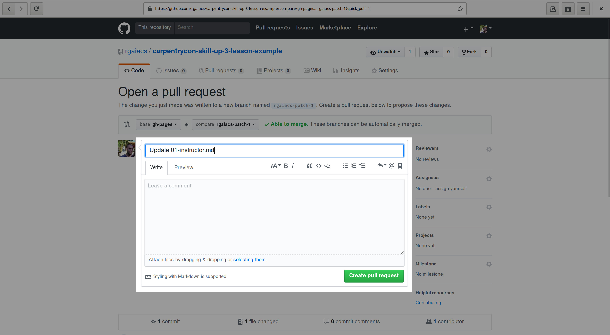

At the end of the page,
you can review the changes that will be included in the pull request.

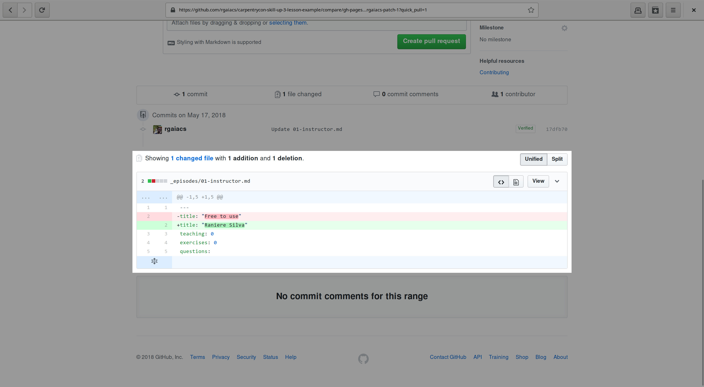

## Review process

With the pull request created,
maintainers can review it
and add comments.

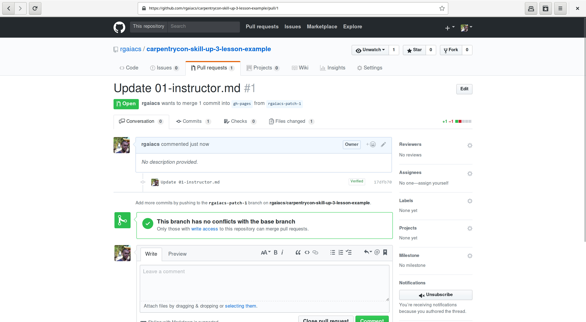

## Questions and Answers

1. **How can I see my changes in the HTML?**

   You can only see the HTML for your `gh-pages` branch.
